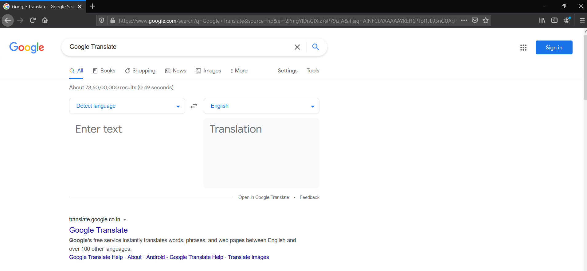

# WebSlither
 A python web browser automation tool

# Web Slither File Parsing
   
   - Run WebSlitherParser.py file
   
     Parser for reading and decoding web slither files

     WebSlither file commands:
     
         # {anything}
         Comment - not considered while decoding 

         driver {Firefox/Chrome/Edge/F/C/E}
         d {Firefox/Chrome/Edge/F/C/E}
         Sets the driver to be used 

         delayScale 1.0
         dS 1.0
         Sets the delay scale to 1.0 seconds 

         delay 0.5
         d 0.5
         Gives a delay of (0.5)*delayScale 

         delayA 1.0
         dA 1.0
         Gives a absolute delay of 1.0 seconds without scale 

         goto {link}
         g {link}
         Loads the given link 

         write i/c/n {id/class/name} {value}
         w i/c/n {id/class/name} {value}
         Writes the value into those fields 

         read i/c/n {id/class/name}
         r i/c/n {id/class/name}
         Reads from the field 

         click i/c/n {id/class/name}
         c i/c/n {id/class/name}
         Clicks the field 

         key i/c/n {id/class/name} {keyName}
         k i/c/n {id/class/name} {keyName}
         Presses the key mentioned in the field

     For example webslither files see [Example](Examples/Example.ws)

     Opens Google Translate webpage

     

# Web Slither Files

   - [DinoGame.ws](Examples/DinoGame.ws)
    
         Opens the classic chrome dino game and plays it by randomly jumping